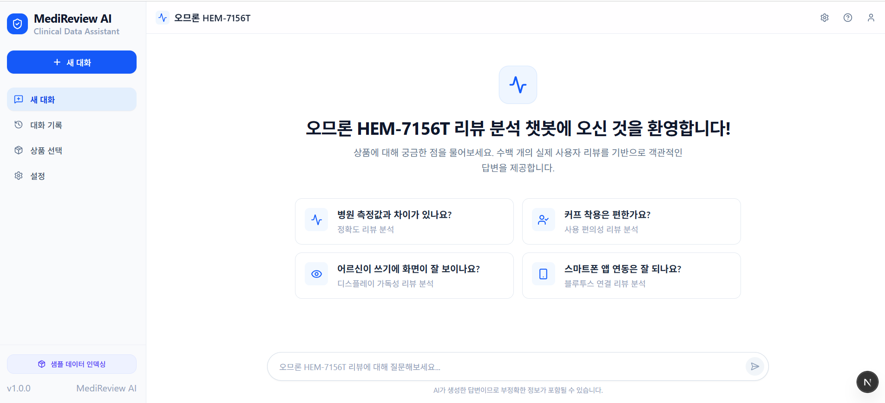
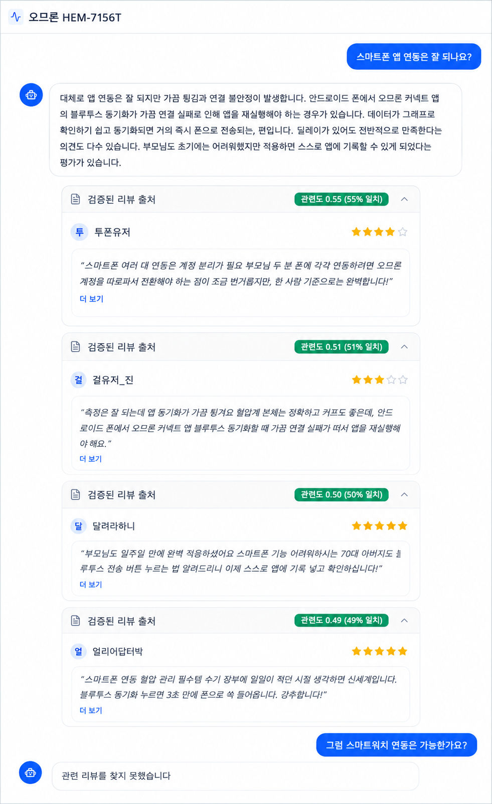

# MediReview AI — 혈압계 리뷰 분석 RAG 챗봇

가정용 혈압계(오므론 HEM-7156T)의 사용자 리뷰를 벡터 검색으로 찾아,
검색된 리뷰만을 근거로 답변하는 RAG 챗봇입니다.

## 주요 기능

- 검색된 리뷰만으로 답변 생성, 일반론 배제
- 참고한 리뷰를 관련도 점수와 함께 출처 카드로 표시
- 긍정/부정 의견을 균형 있게 요약
- 의학적 판단은 시스템 프롬프트로 차단

## 기술 스택

| 구분 | 기술 |
|---|---|
| 프레임워크 | Next.js 16 (App Router) + TypeScript |
| RAG | LangChain (LCEL) |
| 임베딩 | OpenAI text-embedding-3-small |
| 벡터 DB | Pinecone |
| LLM | OpenAI gpt-5-nano |
| DB | Supabase (PostgreSQL) |

## 데이터

실제 리뷰는 약관·저작권 문제로 수집이 어려워, 실제 리뷰 분포(평점 비율,
주제 구성)를 반영한 합성 리뷰 100건을 생성해 사용했습니다.

## 동작 흐름

리뷰 CSV → OpenAI 임베딩 → Pinecone 저장
→ 질문 임베딩 → 유사도 검색 → 필터 → 리뷰 기반 답변 + 출처 카드

## 트러블슈팅

1. **리뷰 저장 권한 오류** — Supabase upsert에는 INSERT와 UPDATE
   권한이 모두 필요. 두 정책을 분리 생성해 해결.
2. **임베딩 차원 불일치** — 임베딩 모델 교체(1024→1536차원)에 맞춰
   Pinecone 인덱스 재생성.
3. **라이브러리 버전 충돌** — LangChain 경유 업로드가 실패해
   Pinecone SDK 직접 호출로 우회.
4. **무관 질문에도 리뷰 표시** — 유사도 점수만으로는 정상/무관 질문
   구분이 어려워, 점수 필터는 1차로만 쓰고 최종 판단은 LLM에 맡김.
   LLM이 "관련 리뷰 없음" 판단 시 출처 카드도 숨김.

## 실행 방법

```bash
npm install --legacy-peer-deps
npm run dev
```


`.env` (프로젝트 루트):

```
PINECONE_API_KEY=
PINECONE_HOST=
NEXT_PUBLIC_SUPABASE_URL=
NEXT_PUBLIC_SUPABASE_PUBLISHABLE_KEY=
OPENAI_API_KEY=
```


접속 후 사이드바 하단 "샘플 데이터 인덱싱" 클릭(최초 1회) → 질문 입력

## 스크린샷

### 웰컴 화면


### 리뷰 기반 답변 + 출처 카드


무관한 질문에는 "관련 리뷰를 찾지 못했습니다"로 응답하며 출처 카드도 표시하지 않습니다.